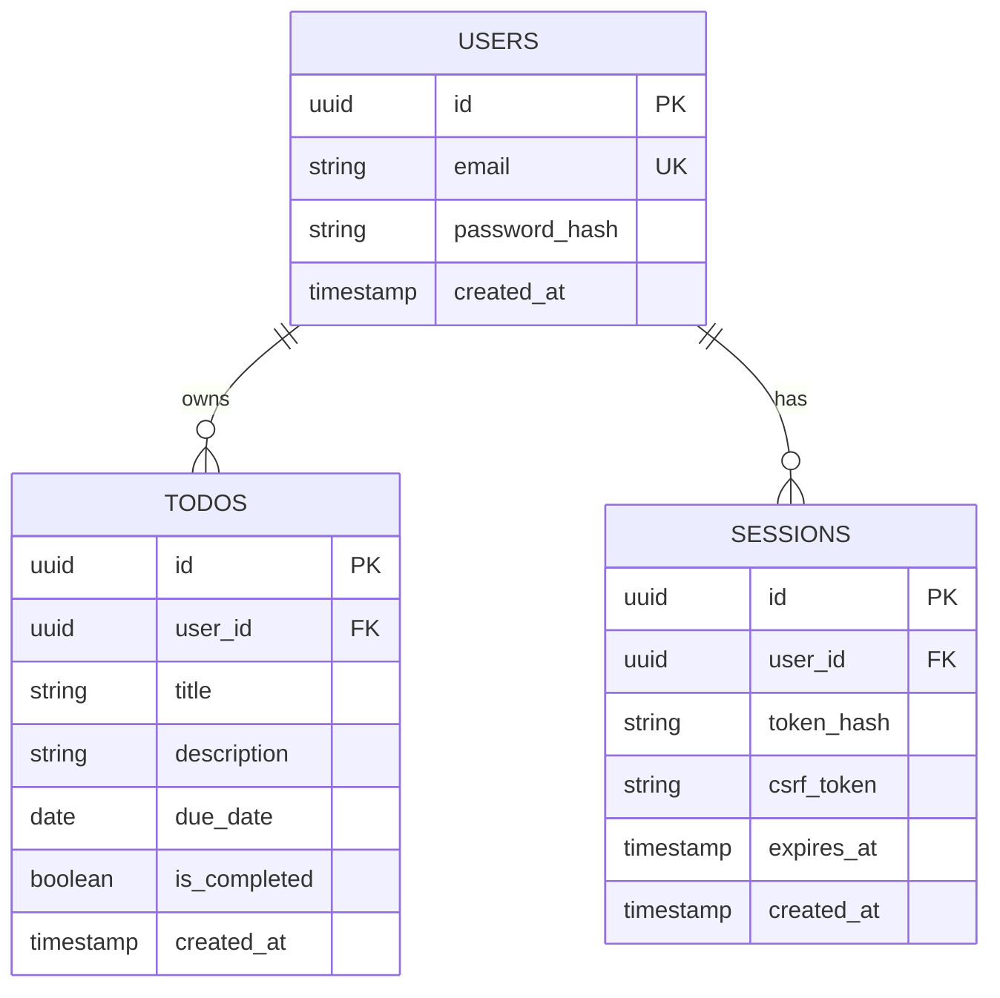
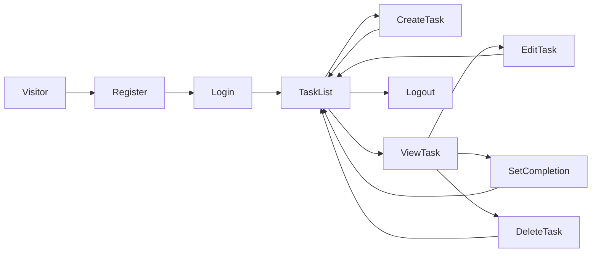

# Architecture Decisions

## Application boundaries

The React frontend and TypeScript backend are separate applications in one repository. The frontend calls the backend through `/api`; only the backend accesses PostgreSQL. This keeps one checkout simple for reviewers while allowing independent builds and deployments.

## Data model

The schema is defined with Drizzle in `apps/backend/src/database/schema.ts`, with a versioned SQL migration. The relationships are:

Session tokens are hashed before storage. PostgreSQL persists accounts, sessions, and tasks in a named Docker volume during local container runs.

## Main user journey

## Security decisions

Passwords use Argon2id hashes. The API scopes task reads and writes to the authenticated user, sends session tokens in HttpOnly, SameSite=Strict cookies, and requires a per-session CSRF token for authenticated mutations. Production cookies are marked Secure. Account recovery and email verification remain outside the assessment implementation. The prepared public deployment configuration requires HTTPS with TLS 1.3; no public deployment has been performed.
