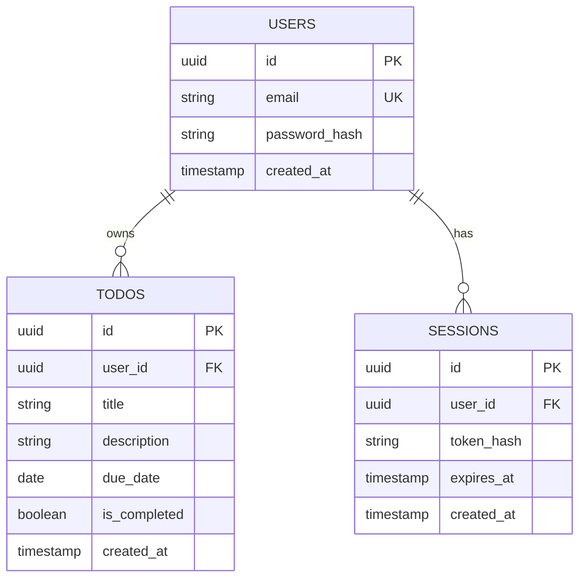
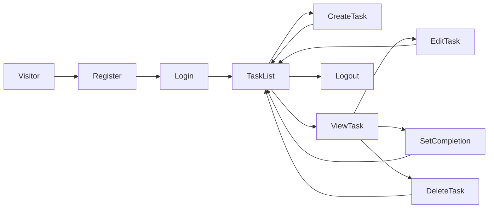

# Architecture Decisions

## Application boundaries

The React frontend and TypeScript backend are separate applications in one repository. The frontend calls the backend through `/api`; only the backend accesses PostgreSQL. This keeps one checkout simple for reviewers while allowing independent builds and deployments.

## Data model

The implementation will define the schema in code and create versioned migrations. The intended relationships are:

Session storage is a design intention until implemented; the final architecture document will reflect the actual code.

## Main user journey

## Security decisions

Password hashing, authenticated task ownership checks, safe cookie configuration, and CSRF protection will be implemented and tested with the authentication slice. Account recovery and email verification are outside this assessment scope; these limits must be stated in the completed README. Public deployment will require HTTPS and disposable demo data.
