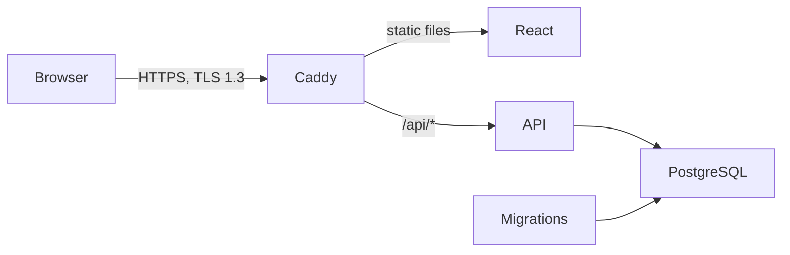

# Container deployment

The repository builds two application images: a Node API and a static React site served by Caddy. Caddy proxies `/api/*` to the API, so browser requests and session cookies stay on one origin. PostgreSQL is not exposed publicly. A one-shot migration container must finish before the API starts. The diagram shows the prepared production topology; the temporary public-IP demo uses HTTP.



## Local container check

From the repository root, with Docker running:

```bash
docker compose up --build --wait -d
```

Open `http://127.0.0.1:8080`. This local-only HTTP endpoint binds to loopback and uses the same Compose database as the development commands. `docker compose ps` shows container health, and `docker compose logs backend web` shows server output. `docker compose down` stops the stack while preserving the database volume. The local Caddy configuration intentionally uses HTTP; the production configuration below enables HTTPS.

## Temporary public-IP demo

`compose.demo.yaml` is a separate, disposable HTTP deployment for an assessment demo without a domain. It exposes only the web server on port 80; PostgreSQL and the API remain on private container networks. Since browsers do not send `Secure` cookies over HTTP, this stack uses `NODE_ENV=demo` so login works. This is **not** the production configuration: passwords and session cookies cross the network without transport encryption. Use only throwaway accounts and non-sensitive tasks, and shut down the instance after the review. Do not reuse passwords from any real account.

On the host, install Docker and clone the repository into `/opt/foci-todo`. Keep the demo settings outside the checkout in `/etc/opt/foci-todo/demo.env`, owned by root with mode `600`. Use a long random hexadecimal database password, and never commit or print the settings file. From `/opt/foci-todo`, run:

```bash
sudo docker compose --env-file /etc/opt/foci-todo/demo.env -f compose.demo.yaml config --quiet
sudo docker compose --env-file /etc/opt/foci-todo/demo.env -f compose.demo.yaml up --build --wait -d
sudo docker compose --env-file /etc/opt/foci-todo/demo.env -f compose.demo.yaml ps
```

Open `http://PUBLIC_IP/` and verify registration, login, task CRUD, and `http://PUBLIC_IP/api/health`. Allow inbound TCP 80 in the EC2 security group and restrict SSH to your own IP. The host does not need inbound PostgreSQL or API ports. The demo configuration is deliberately isolated from the production Compose project and does not provide TLS or durable backups. Its public home page and health endpoint were verified on October 9, 2026; an authenticated browser journey still needs manual verification on the deployed host.

## Production preparation

The production Compose file is prepared for a single EC2 host. It requires a domain pointing to that host and inbound TCP ports 80 and 443. Restrict SSH access to trusted addresses. Set up off-host database backups and test a restore before treating the service as durable.

Copy `.env.production.example` to `.env.production` on the host, set `SITE_DOMAIN` to the real domain, and replace `DB_PASSWORD` with a long random hexadecimal value (for example, generated by `openssl rand -hex 32`). Hexadecimal avoids reserved characters in the PostgreSQL connection URL. Keep the file out of Git and restrict its filesystem permissions. Do not use the example password.

```bash
docker compose --env-file .env.production -f compose.production.yaml config --quiet
docker compose --env-file .env.production -f compose.production.yaml up --build -d
docker compose --env-file .env.production -f compose.production.yaml ps
```

The production stack exposes only Caddy on ports 80/443. Caddy automatically obtains and renews certificates for `SITE_DOMAIN` when DNS and inbound ports are working. The production Caddyfile permits TLS 1.3, redirects HTTP to HTTPS, and adds security headers. The API uses `NODE_ENV=production`, which marks session cookies `Secure`. Database migrations run before API startup, and the Caddy certificate state persists in named volumes.

After DNS and certificates are ready, verify the deployed site and API through the public domain, including registration, sign-in, task CRUD, and `curl --tlsv1.3 --tls-max 1.3 -I https://YOUR_DOMAIN`. Confirm that an HTTP request redirects to HTTPS. Do not point a real domain at this stack until the EC2 instance, DNS, backups, and production values are ready.

The production configuration has been syntax-checked, but no public deployment or certificate issuance has been performed in this repository. EC2 provisioning, DNS setup, backup operations, and real-domain TLS verification are separate deployment steps.
